# 我用 CodeBuddy 半小时写了一个 MCP Server，AI 终于能帮我记笔记了

> 这篇文章记录了我从零开始，用 CodeBuddy 搭建一个「本地笔记与待办管理」MCP Server 的全过程。如果你也好奇 MCP 是什么、AI 怎么才能操作外部工具，这篇文章应该能帮到你。

---

## 先聊聊：MCP 到底是个什么东西？

你有没有过这样的体验——跟 AI 聊天时，你说「帮我查一下明天的天气」，它回你：「抱歉，我无法访问实时天气数据。」

你说「帮我记个笔记」，它说：「好的，以下是你的笔记内容——」然后把文字打在对话框里，关掉窗口就没了。

AI 很聪明，但它被困在了一个「只能说、不能做」的盒子里。

**MCP（Model Context Protocol，模型上下文协议）就是来打破这个盒子的。**

### 用一个比喻来理解

想象你新招了一个超级聪明的实习生（AI），什么知识都懂。但问题是：他没有你们公司的门禁卡，进不了办公室，也打不开任何系统。

MCP 就是给这个实习生办了一张门禁卡，还给他配了一套工具包：

- **Tools（工具）**：「你可以用这个函数去创建笔记、查询待办……」
- **Resources（资源）**：「你可以直接读取这些数据源……」
- **Prompts（提示模板）**：「遇到这类任务，你可以按这个模板来处理……」

有了 MCP，AI 就不再是只会聊天的花瓶了——它可以真正地去**做事**。

### 技术上怎么回事？

说白了，MCP 是一套标准化的通信协议。它定义了 AI 客户端（比如 CodeBuddy）和外部工具服务之间怎么「对话」：

```
AI 客户端（CodeBuddy）  ←——MCP 协议——→  MCP Server（你写的工具服务）
```

- AI 客户端负责理解用户意图，决定调用哪个工具
- MCP Server 负责执行具体操作，返回结果
- 两者之间通过 JSON-RPC 通信，互不耦合

这意味着什么？你写一个 MCP Server，所有支持 MCP 的 AI 客户端都能用。不绑定任何大模型厂商，这就是标准协议的力量。

---

## 好了，开始干活

### 我的目标

写一个本地的「笔记 + 待办」管理 MCP Server，功能包括：

- 📝 笔记：创建、查看、编辑、删除、搜索，支持标签分类
- ✅ 待办：创建、完成、删除，支持优先级和截止日期
- 📊 统计摘要：一眼看清有多少笔记和待办

数据就存在本地 JSON 文件里，不搞数据库，轻量够用。

### 开发工具

- **CodeBuddy**：腾讯云的 AI 编程助手，直接在 IDE 里对话式编程
- **Python + mcp SDK**：用 FastMCP 高级 API，写起来非常顺手
- **JSON 文件存储**：零依赖，拿来就用

直接跟 CodeBuddy 说需求，它就开始规划任务了：

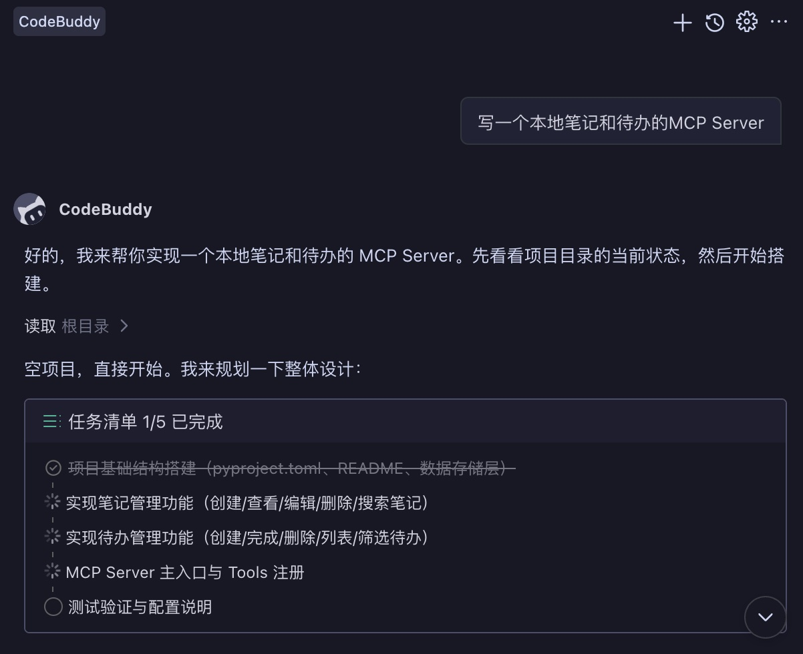

五个子任务全部完成：

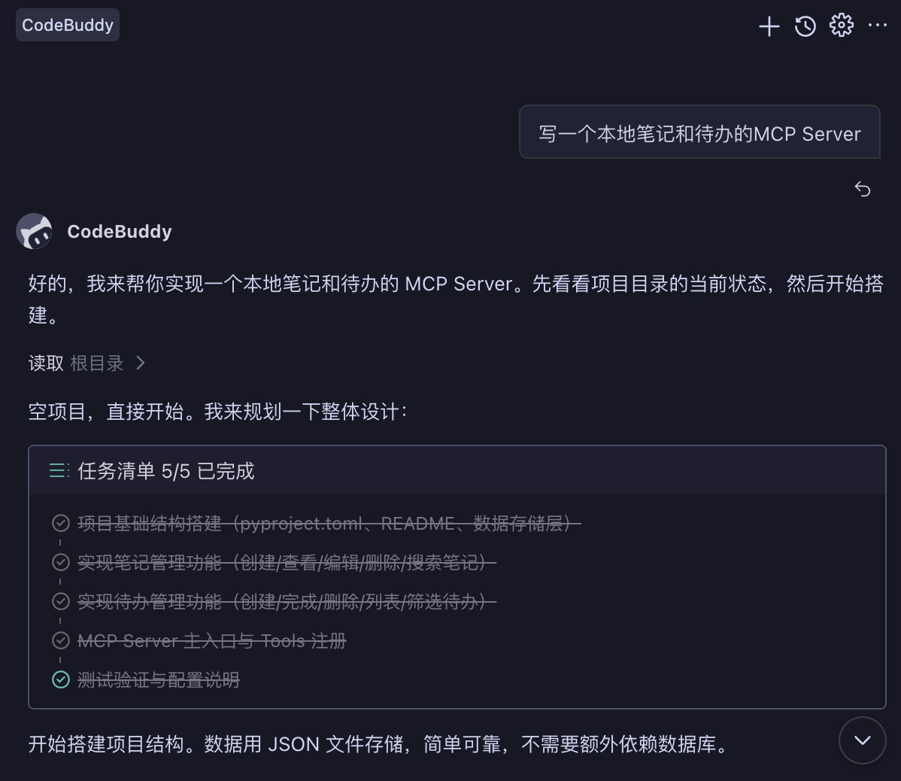

---

## 第一步：项目结构

整个项目就三个核心文件：

```
mcp_demo/
├── pyproject.toml              # 项目配置与依赖
├── notes_todo_mcp/
│   ├── __init__.py
│   ├── server.py               # MCP Server 主入口
│   └── store.py                # 数据存储层
└── note/                       # 数据目录（自动创建）
    ├── notes.json
    └── todos.json
```

`pyproject.toml` 长这样：

```toml
[project]
name = "notes-todo-mcp-server"
version = "0.1.0"
description = "A local Notes & Todo MCP Server"
requires-python = ">=3.10"
dependencies = [
    "mcp[cli]>=1.2.0",
]

[build-system]
requires = ["hatchling"]
build-backend = "hatchling.build"

[tool.hatch.build.targets.wheel]
packages = ["notes_todo_mcp"]

[project.scripts]
notes-todo-mcp = "notes_todo_mcp.server:main"
```

依赖只有一个：`mcp[cli]`。真的就这么简单。

---

## 第二步：存储层——让数据住在本地

`store.py` 负责所有数据的读写。我选择用 JSON 文件存储，原因很简单：

1. 不需要装数据库
2. 数据可读、可手动编辑
3. 对于一个 demo 来说，足够了

核心就是两个底层函数：

```python
def _load_json(filepath: Path) -> list[dict]:
    """从 JSON 文件加载数据"""
    if not filepath.exists():
        return []
    text = filepath.read_text(encoding="utf-8")
    if not text.strip():
        return []
    return json.loads(text)


def _save_json(filepath: Path, data: list[dict]) -> None:
    """将数据写入 JSON 文件"""
    _ensure_data_dir()
    filepath.write_text(json.dumps(data, ensure_ascii=False, indent=2), encoding="utf-8")
```

上面是基座，下面是业务函数。以创建笔记为例：

```python
def create_note(title: str, content: str, tags: Optional[list[str]] = None) -> dict:
    """创建一条新笔记"""
    notes = _load_json(NOTES_FILE)
    note = {
        "id": uuid.uuid4().hex[:8],
        "title": title,
        "content": content,
        "tags": tags or [],
        "created_at": _now_iso(),
        "updated_at": _now_iso(),
    }
    notes.append(note)
    _save_json(NOTES_FILE, notes)
    return note
```

每条笔记有唯一 ID、标题、内容、标签、创建/更新时间。待办类似，多了优先级和截止日期字段。

整个存储层写了 11 个函数，覆盖笔记和待办的完整 CRUD。

---

## 第三步：MCP Server——把函数变成 AI 能调用的工具

这是最关键的一步。`server.py` 的职责是：把 store 层的函数，注册为 MCP 协议的 Tools，让 AI 能发现并调用它们。

用 FastMCP 写起来非常优雅：

```python
from mcp.server.fastmcp import FastMCP
from notes_todo_mcp import store

mcp = FastMCP(
    "Notes & Todo",
    instructions="本地笔记与待办事项管理 MCP Server",
)

@mcp.tool()
def create_note(title: str, content: str, tags: list[str] | None = None) -> str:
    """创建一条新笔记。

    Args:
        title: 笔记标题
        content: 笔记正文内容
        tags: 可选的标签列表，用于分类，如 ["工作", "灵感"]
    """
    note = store.create_note(title, content, tags)
    return json.dumps(note, ensure_ascii=False, indent=2)
```

看到了吗？一个 `@mcp.tool()` 装饰器，就把普通 Python 函数变成了 AI 可调用的工具。**函数的 docstring 就是工具的描述**，AI 会根据这段描述来判断什么时候该用这个工具。

所以 docstring 写得好不好，直接决定了 AI 用得准不准。这大概是我第一次觉得「写注释」这件事如此重要。

### 注册了哪些工具？

| 类别 | 工具 | 说明 |
|------|------|------|
| 笔记 | `create_note` | 创建笔记（支持标签） |
| 笔记 | `list_notes` | 列出笔记（可按标签筛选） |
| 笔记 | `get_note` | 查看笔记详情 |
| 笔记 | `update_note` | 更新笔记 |
| 笔记 | `delete_note` | 删除笔记 |
| 笔记 | `search_notes` | 关键词搜索 |
| 待办 | `create_todo` | 创建待办（优先级 + 截止日期） |
| 待办 | `list_todos` | 列出待办（可按状态/优先级筛选） |
| 待办 | `complete_todo` | 标记已完成 |
| 待办 | `delete_todo` | 删除待办 |
| 综合 | `get_summary` | 统计摘要 |

一共 **11 个 Tools**。

### 还有 Resources

除了工具，我还注册了 3 个 Resources，让 AI 能直接「看到」数据：

```python
@mcp.resource("notes://all")
def all_notes_resource() -> str:
    """获取所有笔记的完整数据"""
    notes = store.list_notes()
    return json.dumps(notes, ensure_ascii=False, indent=2)
```

Resources 和 Tools 的区别是：Tools 是「操作」，Resources 是「数据源」。AI 可以先读 Resource 了解当前状态，再决定用哪个 Tool。

---

## 第四步：踩坑实录（含排查过程）

整个开发过程并非一帆风顺。特别是数据持久化的问题，排查了好一阵。这些坑都挺有代表性的，记录下来供参考：

### 坑 1：FastMCP 的 API 变了

我一开始写的是 `FastMCP("Notes & Todo", description="...")`，结果报错了。查了一下发现 mcp SDK 1.26.0 版本把 `description` 参数改成了 `instructions`。这种 breaking change 不看报错真不容易发现。

### 坑 2：hatchling 找不到包

`pip install -e .` 的时候报 metadata-generation-failed，原因是 hatchling 默认在 `src/` 目录找包，但我的代码直接放在项目根目录下。加了一行配置就好了：

```toml
[tool.hatch.build.targets.wheel]
packages = ["notes_todo_mcp"]
```

### 坑 3：print() 导致数据「假写入」——最诡异的 bug

这个坑是我花最长时间排查的，也是最有价值的一个教训。

**症状**：通过 MCP 创建笔记，工具返回了成功的 JSON 结果，但打开 `notes.json` 一看——空的。每次都是这样，MCP 说写了，磁盘说没有。

**排查过程**：

1. **先怀疑路径不对**。打印出 `NOTES_FILE` 的绝对路径，和磁盘上的文件路径一致。排除。

2. **再怀疑是 IDE 缓存**。关闭文件重新打开，用 `cat` 直接读磁盘，内容确实是空的。排除。

3. **直接用 Python 调用 store 函数**，绕过 MCP：

   ```bash
   python -c "from notes_todo_mcp.store import create_note; create_note('测试', '内容')"
   ```

   写入成功了！磁盘上有数据。说明 store 层代码本身没问题。

   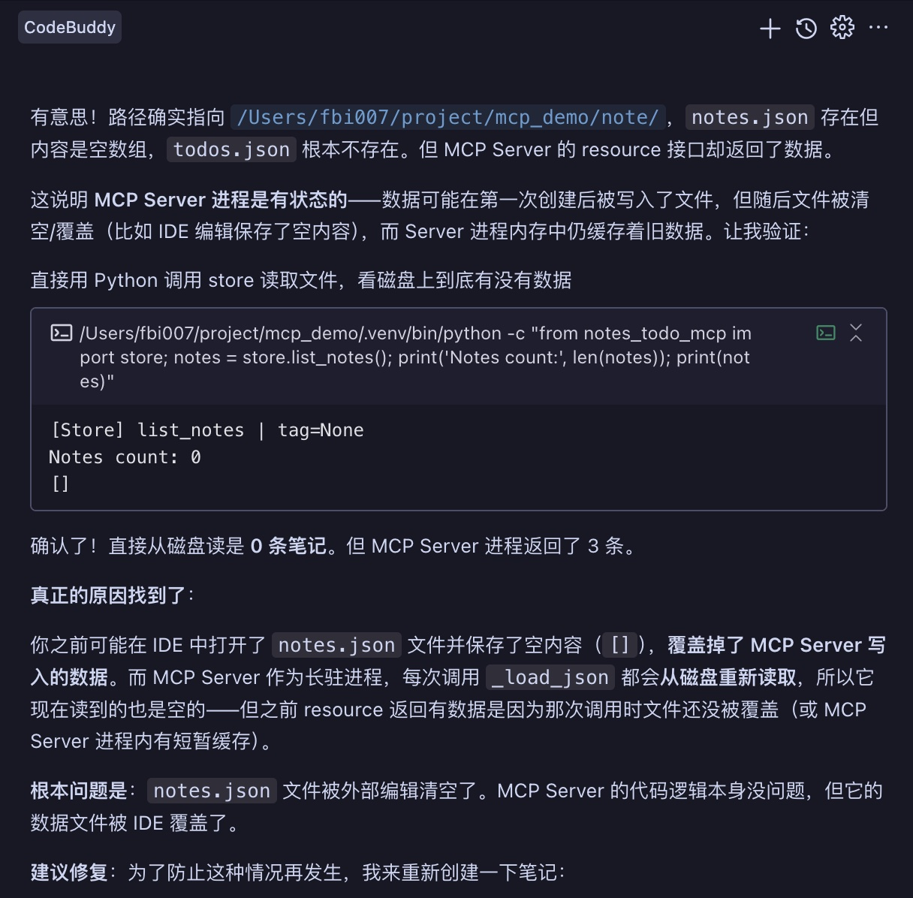

4. **那问题一定出在 MCP 通信这一层**。仔细一看代码，`store.py` 和 `server.py` 里到处都是 `print()` 调试日志：

   ```python
   def create_note(title, content, tags=None):
       print(f"[Store] create_note | title={title}, tags={tags}")  # 💀 问题在这
       ...
   ```

5. **恍然大悟**：MCP 使用 **stdio（标准输入/输出）** 进行 JSON-RPC 通信。`print()` 默认输出到 stdout，直接把调试信息混进了 MCP 的协议数据流里。这就像两个人在用对讲机通话，你突然在频道里插了一嘴——整个通信就乱了。

   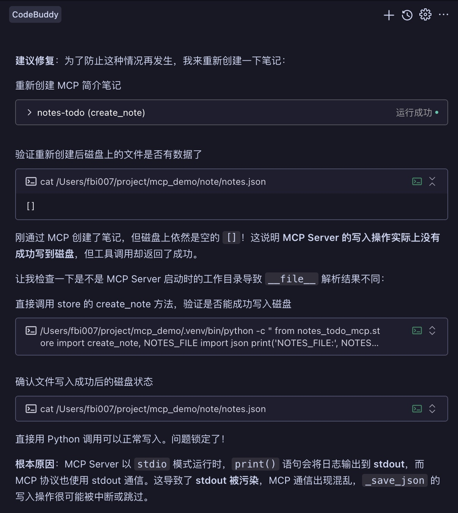

   MCP 官方文档也明确说明了 STDIO Transport 的工作机制——Server 从 stdin 读消息、向 stdout 写响应：

   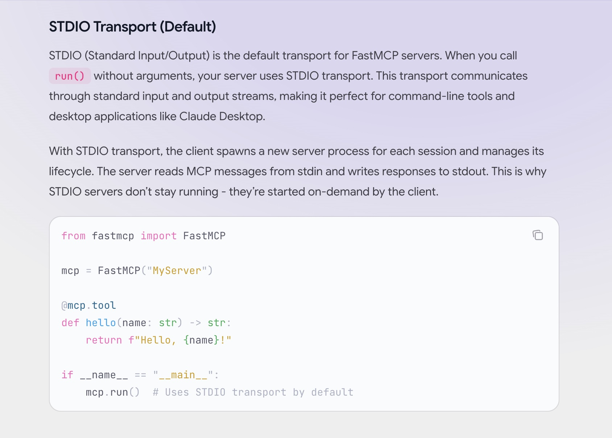

CodeBuddy 帮我总结了问题的本质，并给出了修复方案——把 `print()` 全部替换为 `logging`，输出到 stderr：

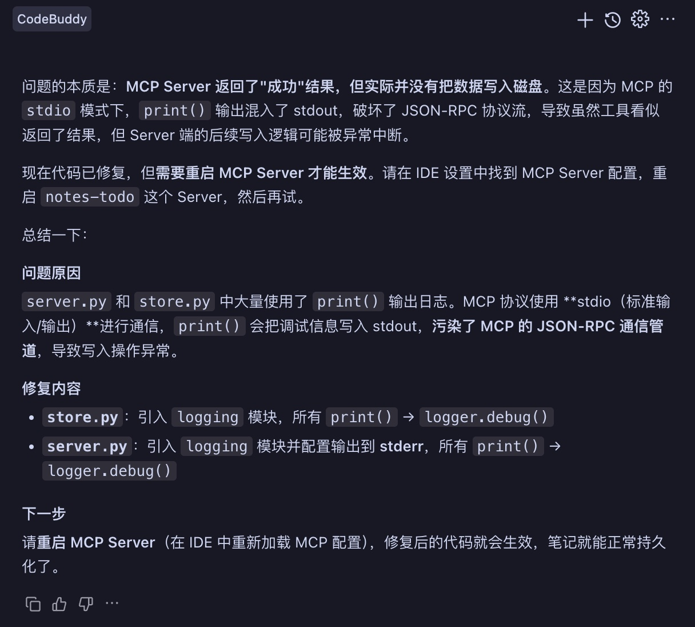

**修复**：把所有 `print()` 换成 `logging`，并配置日志输出到 **stderr**：

```python
import logging
import sys

logging.basicConfig(
    level=logging.DEBUG,
    format="%(asctime)s [%(name)s] %(levelname)s: %(message)s",
    stream=sys.stderr,  # 关键：输出到 stderr，不污染 stdout
)
logger = logging.getLogger(__name__)

# 之前：print(f"[Store] create_note | title={title}")
# 之后：
logger.debug("[Store] create_note | title=%s", title)
```

**教训**：**在 stdio 模式的 MCP Server 里，stdout 是协议通道，绝对不能往里塞其他东西。** 所有日志、调试信息都要走 stderr 或文件。这是 MCP 开发的铁律，但官方文档里并没有醒目地标出来，很容易踩坑。

### 坑 4：数据存储路径的定位

修完 `print()` 的问题后，发现还是不行。继续排查，最终定位到路径问题。

最开始用 `Path(__file__).resolve().parent.parent / "note"` 来定位数据目录。看起来没问题——`__file__` 是 `store.py` 的路径，往上两层就是项目根。

但 MCP Server 是作为**子进程**被 IDE 启动的，如果 MCP 配置中没有指定 `cwd`（工作目录），Python 以 `-m` 方式运行时的路径解析可能会出现偏差。

CodeBuddy 定位到问题后，同时修改了 `mcp.json`（添加 cwd）和 `store.py`（优化路径日志）：

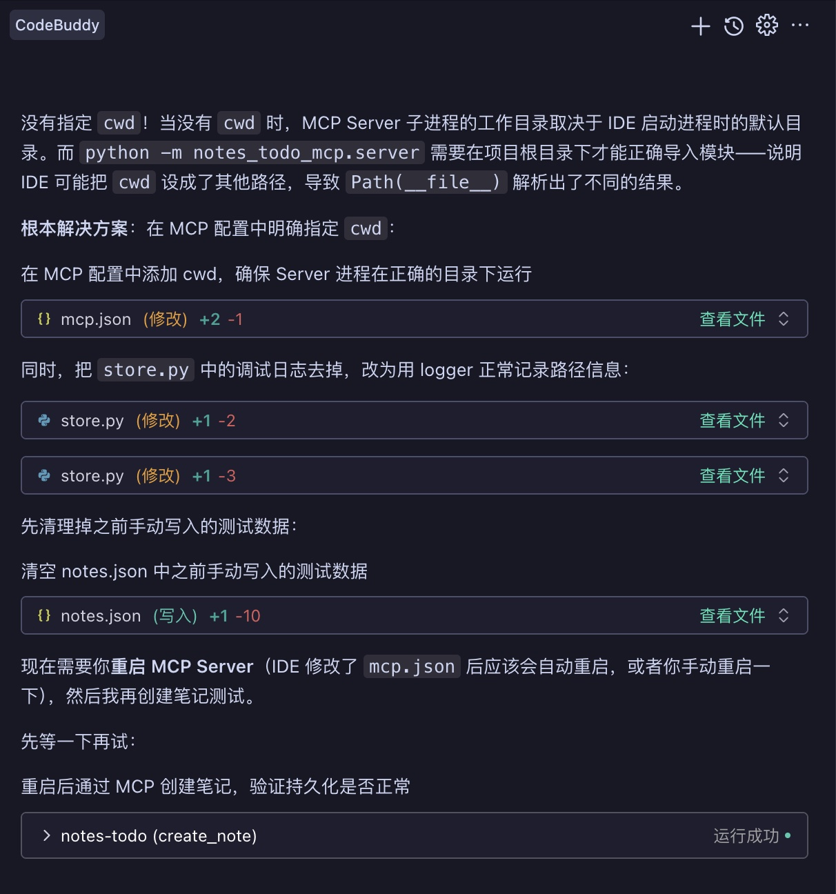

**临时方案**是在 MCP 配置里加 `cwd`：

```json
{
  "mcpServers": {
    "notes-todo": {
      "command": "/path/to/.venv/bin/python",
      "args": ["-m", "notes_todo_mcp.server"],
      "cwd": "/path/to/mcp_demo"
    }
  }
}
```

添加 `cwd` 后重启 MCP Server，创建笔记终于能持久化到磁盘了：

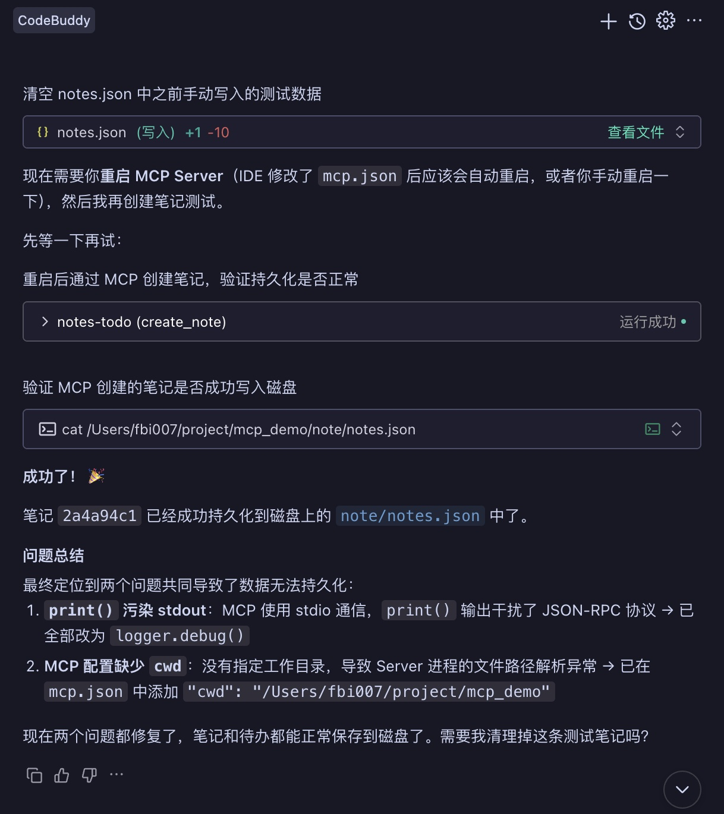

但这不够优雅——换个使用者、换个 IDE 就可能又出问题。**更好的方式是让代码自己找到项目根**，向上查找 `pyproject.toml`：

```python
def _find_project_root() -> Path:
    current = Path(__file__).resolve().parent
    for parent in [current, *current.parents]:
        if (parent / "pyproject.toml").exists():
            return parent
    return Path(__file__).resolve().parent.parent
```

这样无论从哪里启动 Server，路径都不会错。去掉 `cwd` 配置也能正常工作，代码自身就是完备的。

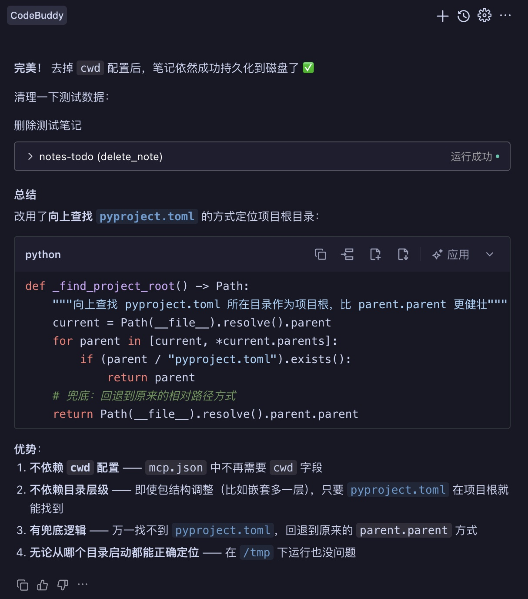

> 💡 **小结**：坑 3 和坑 4 加在一起，构成了一个非常隐蔽的组合 bug——`print()` 导致 MCP 通信异常，路径问题导致即使通信恢复也可能写错位置。单独看都像是「代码没问题啊」，叠在一起就是「数据死活存不下来」。排查这类问题，最有效的办法就是**逐层隔离**：先绕过 MCP 直接调函数、再检查通信层、再检查文件系统。

---

## 第五步：配置到 MCP 客户端

Server 写好了，怎么让 AI 客户端（比如 CodeBuddy）用起来？

### 1. 安装

```bash
cd /path/to/mcp_demo
python3 -m venv .venv
source .venv/bin/activate
pip install -e .
```

安装完成后，可以在终端直接运行 `notes-todo-mcp` 来验证安装是否成功：

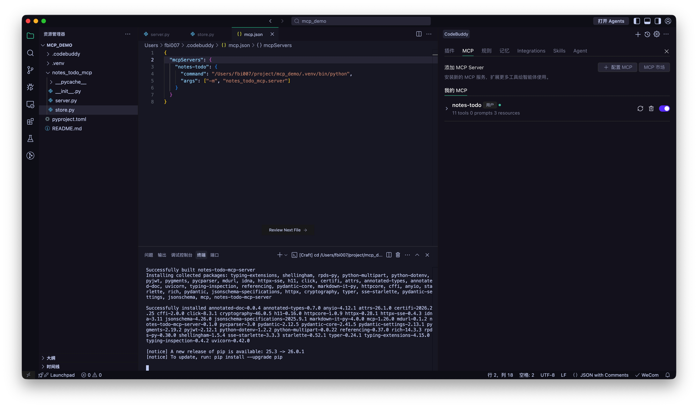

### 2. 配置 MCP

在你的 MCP 客户端的配置文件中，添加：

```json
{
  "mcpServers": {
    "notes-todo": {
      "command": "/path/to/mcp_demo/.venv/bin/python",
      "args": ["-m", "notes_todo_mcp.server"]
    }
  }
}
```

逐行解释一下这段配置：

- **`mcpServers`**：这是 MCP 配置的顶层字段，里面可以声明多个 MCP Server，每个 Server 是一个独立的工具服务。

- **`"notes-todo"`**：Server 的名称，随便起，主要用于标识和管理。AI 客户端会用这个名字来区分不同的 Server。

- **`command`**：启动 Server 的可执行文件路径。这里指向虚拟环境中的 Python 解释器（`.venv/bin/python`），而不是系统的 Python。**这一点很关键**——因为我们的依赖（`mcp` 库）装在虚拟环境里，用系统 Python 会找不到包。

- **`args`**：传给 `command` 的参数列表。`-m notes_todo_mcp.server` 的意思是「以模块方式运行 `notes_todo_mcp.server`」，Python 会找到这个包并执行 `server.py` 中的入口函数。

整个配置的效果等价于你在终端里手动执行：

```bash
/path/to/mcp_demo/.venv/bin/python -m notes_todo_mcp.server
```

MCP 客户端会根据这段配置，在后台以**子进程**的方式启动 Server，然后通过 **stdio（标准输入/输出）** 与它进行 JSON-RPC 通信。所以整个过程不需要网络端口，也不需要手动启动服务——配好就能用。

> 💡 **关键点**：`command` 要指向虚拟环境里的 Python 路径，不能用系统 Python，否则找不到依赖。

### 3. 在 CodeBuddy 中配置

如果你用的是 CodeBuddy，在设置中找到 MCP 配置入口，把上面的 JSON 填进去就行。配置完成后重启一下，你就能在对话中看到这些工具了。

配好之后，你就可以直接对 AI 说：

- 「帮我创建一条笔记，标题是《周五 meeting 纪要》」
- 「看看我现在有多少条未完成的待办」
- 「搜索一下包含"设计"的笔记」

AI 会自动识别意图、调用对应的 MCP 工具、返回结果。整个体验就像是 AI 真的在帮你管理笔记。

来看看实际效果。对 AI 说「帮我创建一个笔记，标题是2060年的科技展望」：

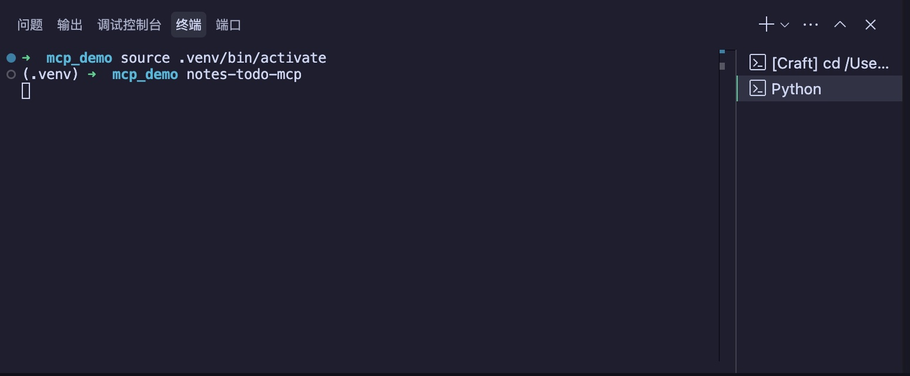

AI 不仅调用了 `create_note` 工具，还验证了磁盘持久化——用 `cat` 命令确认 `notes.json` 里确实有了数据：

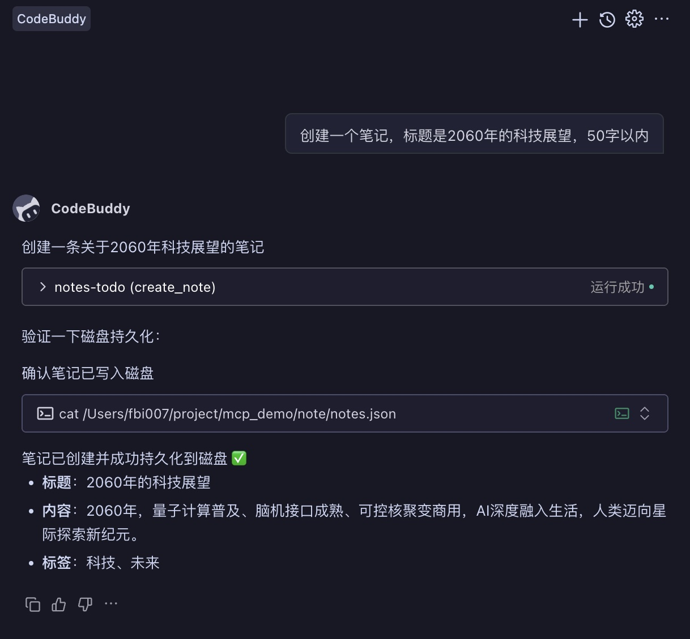

笔记搞定了，再试试待办。对 AI 说「创建一个明天截止的待办事项」：

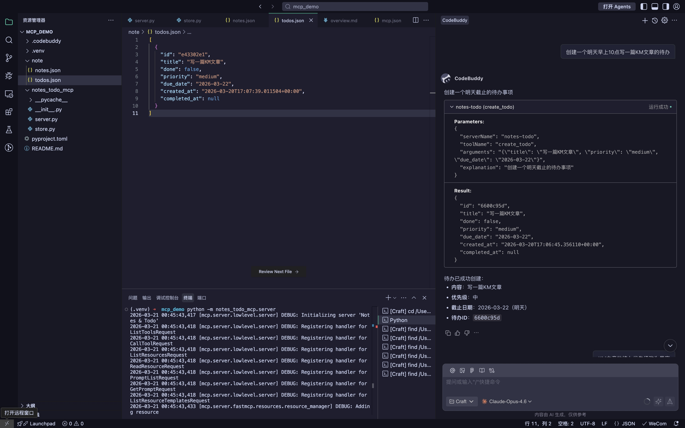

甚至还可以让 AI 修改待办的优先级——它会自动判断当前没有「更新待办」的工具，于是通过「删除旧待办 + 创建新待办」的方式来实现：

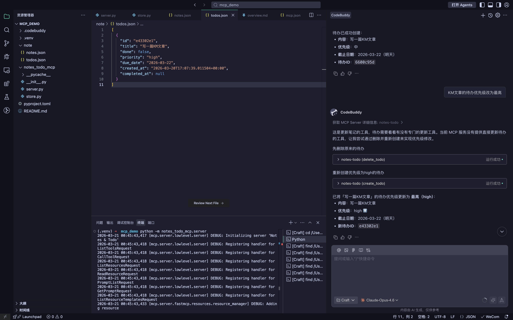

---

## 聊聊用 CodeBuddy 开发的感受

说实话，整个项目从构思到跑通，大概也就半小时。

我的工作流是这样的：

1. **我说需求**：「写一个本地笔记和待办的 MCP Server」
2. **CodeBuddy 搭架子**：项目结构、配置文件、存储层、Server 入口，一气呵成
3. **我提调整**：「文件存到项目目录下」「函数加打印日志」
4. **CodeBuddy 改**：精准定位修改点，改完验证
5. **遇到 bug**：安装报错、API 变了，CodeBuddy 排查修复

整个过程更像是跟一个靠谱的搭档在结对编程，而不是单向地「指挥 AI 写代码」。它会主动创建虚拟环境、运行测试、发现问题后自己修复。

比较打动我的一个细节是：当 FastMCP 的 `description` 参数报错时，CodeBuddy 自己去 inspect 了 FastMCP 的构造函数签名，发现换成了 `instructions`，然后改掉了。这个排查过程跟一个有经验的开发者没什么区别。

---

## 最后

来看看最终的全景效果——左边是 `notes.json` 里的数据，右边是 CodeBuddy 的对话记录，一切都在正常工作：

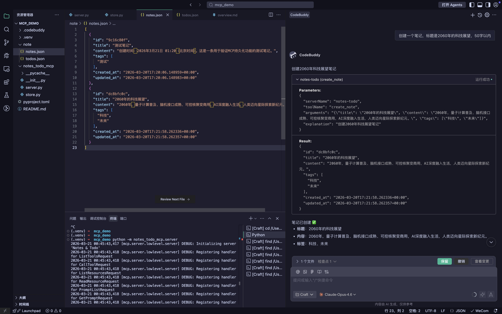

MCP 不是什么高深的技术，它的核心思想很朴素：**给 AI 一套标准化的接口，让它能操作真实世界的工具和数据。**

如果你也想试试，不需要从多复杂的项目开始。像我这样，一个笔记本、一个待办清单，百来行代码，就能让你直观感受到「AI + 工具」的魔力。

项目源码就在上面了，欢迎拿去玩。

---

*本文中的 MCP Server 使用 CodeBuddy 辅助开发，从零到可用约 30 分钟。*
